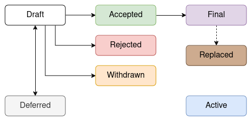

## What is a AIP?

A Aerium Improvement Proposal, or AIP, is a design document that provides information or
describes a new feature for the Aerium blockchain.
The primary goal of a AIP is to encourage the development team to write down ideas before implementation and
invite the community to contribute more efficiently.
It also helps to brainstorm, review, and discuss changes and potential issues before
they can impact the production environment.

## AIP workflow

The AIP process starts with an idea for the Aerium blockchain.
The author should document the idea in AIP format and explain it in simple and
[plain English](https://www.plainenglish.co.uk/free-guides).
The drafted AIP can then be submitted to the AIP repository.

The AIP should be assigned a proper number and category before it gets merged.
Once the AIP is merged into the repository,
a [discussion](https://github.com/aerium-network/aip/discussions) page will be created for it.
All discussions around the AIP will be conducted on this discussion page.

Authors can update drafts as needed through pull requests until the AIP is approved.
Once a AIP is approved, the implementation of the AIP can begin.

## AIP Status

The typical paths of the status of AIPs are as follows:

- **Draft**: The AIP is in the initial stage and is being actively worked on.
  It is open for feedback and suggestions from the community.

- **Accepted**: The AIP has been reviewed and accepted for implementation.
  It indicates that the idea has been thoroughly discussed and is ready to be worked on by developers.

- **Final**: The AIP has been fully implemented and is now part of the Aerium protocol.
  It indicates that the changes proposed in the AIP are live and operational.

- **Replaced**: The AIP has been replaced by a newer AIP.
  This typically happens when the proposed changes are superseded by a more effective or updated solution.

- **Deferred**: The AIP is on hold and not currently being considered for implementation.
  It may be revisited in the future based on community needs and priorities.

- **Withdrawn**: The AIP has been withdrawn by the author.
  This can occur if the author decides not to pursue the idea.

- **Rejected**: The AIP has been reviewed and rejected.
  This status indicates that the proposed changes are not suitable for implementation within the Aerium protocol.

- **Active**: The AIP is continually being updated and has not reached a state of finality.
  This status is typically reserved for documents that require ongoing updates and revisions,
  such as this document, AIP-1.

## AIP Formats and Templates

AIPs should be written in [Markdown](https://www.markdownguide.org/cheat-sheet/) format.
A [template](https://github.com/aerium-network/aip/blob/main/aip-template.md) is provided,
containing inline comments that briefly explain each field.
Please follow these comments and complete the AIP accordingly.

## AIP Types

There are types of a AIP:

### Standards Track

Standards Track AIPs propose changes to the Aerium blockchain's protocols,
including improvements to the core protocol, network, or any other standards.

### Informational

Informational AIPs describe Aerium design issues, guidelines, or general information
that is not suitable for the Standards Track.
They may also propose features or ideas for further discussion within the community.

### Process

Process AIPs propose changes to the AIP process itself or suggest improvements to
the decision-making process within the Aerium community.

## AIP Categories

Standards AIPs are categorized into the following layers:

### Core

Core AIPs propose changes to the fundamental aspects of the Aerium protocol.
These changes are critical and require careful consideration due to their potential impact on the entire network.

### Network

Network AIPs focus on changes related to network communication.
This includes improvements to the peer-to-peer protocol, network topology, and related networking functionalities.

### Interface

Interface AIPs propose changes to the external interfaces of the Aerium protocol, such as APIs.
These changes impact how developers interact with the Aerium blockchain.

### Wallet

Wallet AIPs propose changes to the Aerium native wallet, including
updates to the cryptographic signature scheme, HD wallet improvements, and related features.
