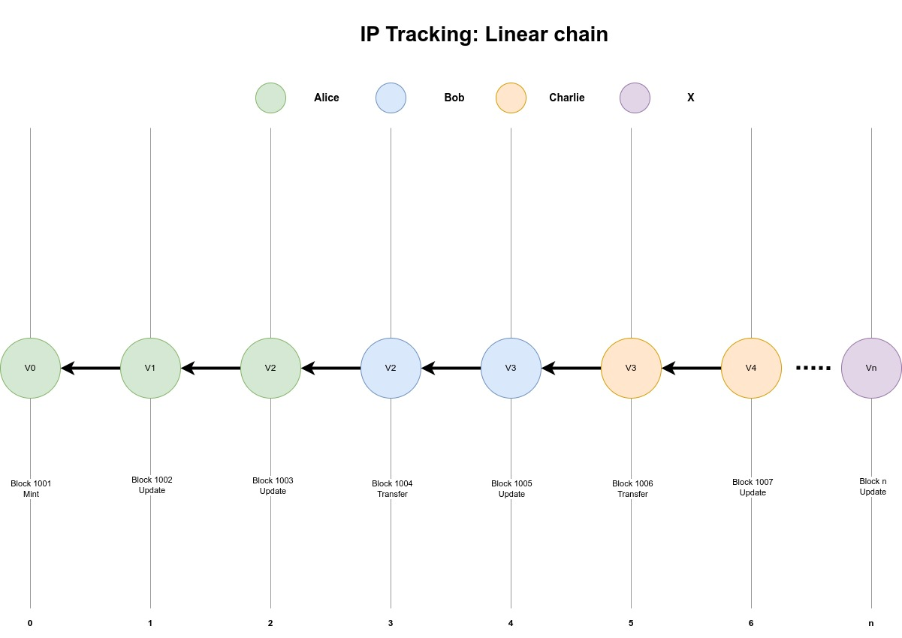

## Abstract

This proposal introduces a native Layer-1 transaction type for the Aerium
blockchain that enables decentralized intellectual property registration,
ownership tracking, and provenance management without relying on smart
contracts. The system implements a privacy-preserving hash-based proof mechanism
using BLAKE2b cryptographic functions to ensure data integrity while maintaining
confidentiality of asset content. The proposed IP Registry system
supports comprehensive metadata management with optional fields including title,
content type, public links, and file size, while maintaining a mandatory version
control system that creates an immutable chain of ownership and modifications
similar to distributed version control systems.

The implementation leverages cryptographic signatures `(Ed25519/Secp256k1)` to
establish proof of ownership and authenticity, with transaction sizes optimized
to range from `121 bytes` for minimal registrations to `558 bytes` for full
transfers including complete metadata. Unlike existing NFT-based solutions that
require smart contract overhead, this native approach provides superior
performance, lower costs, and enhanced privacy through selective metadata
disclosure. The system addresses key challenges in digital asset management by
providing tamper-proof ownership records, complete version history tracking, and
seamless ownership transfer capabilities while preserving user privacy and
maintaining blockchain efficiency.

This framework establishes a foundation for decentralized intellectual property
management that can serve various use cases including digital art provenance,
software licensing, academic publication tracking, and creative content
ownership verification, positioning Aerium as a blockchain platform specifically
optimized for intellectual property applications.

## Motivation

The exponential growth of digital assets and intellectual property in blockchain
ecosystems has created an urgent need for native, efficient ownership tracking
mechanisms. Current solutions face several critical limitations:

**Privacy vs Transparency Trade-offs**: Traditional blockchain systems offer
complete transparency at the expense of privacy, while full zero-knowledge proof
systems provide maximum privacy but introduce prohibitive computational overhead
unsuitable for high-throughput environments. Neither approach adequately serves
creators who need selective privacy with transparent ownership history.

**Validator Complexity**: Existing solutions require complex validation logic
that strains network resources. The computational overhead of verifying smart
contract states or full zero-knowledge proofs significantly impacts network
performance.

This proposal addresses these challenges by introducing a native Layer-1
transaction type that combines the simplicity of traditional cryptographic
proofs with selective privacy features. Unlike full zero-knowledge systems that
hide all information, our approach enables creators to selectively disclose
metadata while maintaining content privacy through cryptographic hashing.

The proposed system draws inspiration from distributed version control systems
like Git, providing linear versioning with clear ownership transitions. This
familiar paradigm reduces complexity for both implementers and users while
ensuring efficient validation by network participants.

## Specification

This specification formalizes the design and mechanism for three native Layer-1
transaction types dedicated to Intellectual Property (IP) Provenance and
Ownership Tracking on the Aerium blockchain. It ensures efficient, secure, and
privacy-preserving registration, versioning, and transfer of digital assets,
with a focus on simplicity, scalability, and cryptographic integrity.

### Transaction Type Definition

#### Current Aerium Transaction Types

Currently, transactions in Aerium support the following payload types:

- **Transfer Payload** (PayloadType: `1`) - Native token transfers between addresses
- **Bond Payload** (PayloadType: `2`) - Validator staking operations
- **Sortition Payload** (PayloadType: `3`) - Consensus participation mechanism
- **Unbond Payload** (PayloadType: `4`) - Validator unstaking operations
- **Withdraw Payload** (PayloadType: `5`) - Reward withdrawal operations
- **Batch Transfer Payload** (PayloadType: `6`) - Multiple transfers in single transaction

#### New IP Registry Payload Types

This AIP proposes the addition of four new payload types for intellectual property management:

- **IP Mint Payload** (PayloadType: `7`) - Initial intellectual property registration
- **IP Update Payload** (PayloadType: `8`) - Content or metadata modification while preserving ownership
- **IP Transfer Payload** (PayloadType: `9`) - Ownership transfer to a new address
- **IP Burn Payload** (PayloadType: `10`) - Permanent destruction of IP ownership

This approach provides **zero ambiguity**, **compile-time type safety**, and
**optimal payload sizes** while maintaining **perfect alignment** with Aerium's
existing architecture patterns.

### Content ID System

The IP Registry introduces a **Content ID** system that provides stable, permanent identification
for intellectual property assets across their entire lifecycle.

**Content ID Generation**:

$$
ContentID = BLAKE2b-256(InitialContentHash || Owner || BlockNumber)
$$

Where:

- `InitialContentHash`: BLAKE2b-256 hash of original file content
- `Owner`: Address of initial owner (21 bytes)
- `BlockNumber`: Block number of mint transaction (lock time) (8 bytes, big-endian)

**Content ID Properties**:

- **Permanent**: Never changes throughout IP lifecycle
- **Unique**: Cryptographically guaranteed uniqueness
- **Deterministic**: Can be reproduced given mint transaction data

### Version Control Semantics

The IP Registry implements **semantic version control** where version numbers have
clear, specific meaning:

**Version Increment Rules**:

- **MINT**: Always version 0 (initial registration)
- **UPDATE**: Version increments by 1 (content or metadata changed)
- **TRANSFER**: **Version unchanged** (ownership transfer only)
- **BURN**: Version increments by 1 (final state change)

**Rationale**: This approach follows industry standards where version numbers reflect
content changes, not ownership changes. Similar to Git commits (content changes)
vs. repository ownership transfers (no new commit), or patent numbers (constant)
vs. patent ownership (transferable).

### Payload Size Analysis

| Operation | Fixed Fields | Optional Metadata | Total Range |
|-----------|-------------|-------------------|-------------|
| **IP Mint** | 185 bytes | 0-372 bytes | 185-557 bytes |
| **IP Update** | 217 bytes | 0-372 bytes | 217-589 bytes |
| **IP Transfer** | 250 bytes | 0-372 bytes | 250-622 bytes |
| **IP Burn** | 221 bytes | 0-100 bytes | 221-321 bytes |

## Payload Structures

All IP Registry operations share the following metadata fields for selective privacy control:

| Field | Type | Size | Description | Required |
|-------|------|------|-------------|----------|
| Metadata.Title | `string` | 100 Bytes | Asset title (UTF-8, ~50-100 characters) | *1 |
| Metadata.Size | `uint64` | 8 Bytes | File size in bytes | *1 |
| Metadata.ContentType | `string` | 64 Bytes | MIME type (RFC 6838 compliant [^1]) | *1 |
| Metadata.PublicLink | `string` | 200 Bytes | Public access URL | *2 |

**Privacy Notes:**

- `*1`: Optional metadata field - can be omitted for privacy control
- `*2`: Optional public link field - can be omitted to maintain content location privacy

### On‑chain Optional Metadata Layout (372 bytes)

- Fixed slots in order: Title (100 bytes), Size (8 bytes, uint64 big‑endian),
  ContentType (64 bytes), PublicLink (200 bytes).
- If a field is omitted, its entire slot MUST be all zero bytes.
- Strings: UTF‑8, NFC normalized, left‑justified, NUL (0x00) padded to slot size.
  Truncate at the last complete code point that fits.
- Size: uint64 big‑endian.
- The total block is always present (372 bytes); omission is signaled by zeroed slots.

### Supported URL Formats

The `PublicLink` field supports both centralized and decentralized storage:

- **IPFS Protocol**: `ipfs://QmXXXXX...` (46+ characters)
- **IPFS HTTP Gateway**: `https://ipfs.io/ipfs/QmXXXXX...` (65+ characters)
- **IPFS Custom Gateway**: `https://gateway.pinata.cloud/ipfs/QmXXXXX...` (80+ characters)
- **Standard HTTP/HTTPS**: Custom URLs for traditional hosting

### 1. IP Mint Payload (PayloadType: `7`)

**Purpose**: Initial registration of intellectual property with permanent Content ID assignment

**Payload Structure**:

| Field | Type | Size | Description | Required |
|-------|------|------|-------------|----------|
| ContentID | `Hash` | 32 Bytes | Permanent IP identifier (generated deterministically) | ✅ |
| Owner | `Address` | 21 Bytes | Initial owner address | ✅ |
| ContentHash | `Hash` | 32 Bytes | BLAKE2b-256 hash of file content | ✅ |
| MetadataHash | `Hash` | 32 Bytes | BLAKE2b-256 hash of serialized metadata | ✅ |
| Version | `uint32` | 4 Bytes | Sequential version number (must be 0) | ✅ |
| Signature | `Bytes` | 64 Bytes | Ed25519/ECDSA signature of computed ProofHash | ✅ |
| *Optional Metadata* | *Various* | *372 Bytes* | Title, Size, ContentType, PublicLink | *1, *2 |

**Validation Rules:**

- `Version` MUST equal `0`
- `ContentID` MUST be unique (not previously registered)
- `ContentID` MUST be calculated correctly from initial content and owner
- `Owner` becomes initial IP owner

**ProofHash Calculation**:

$$
ProofHash_{MINT} = H(ContentID \parallel ContentHash \parallel MetadataHash \parallel Version)
$$

### 2. IP Update Payload (PayloadType: `8`)

**Purpose**: Content or metadata modification while preserving ownership and Content ID

**Payload Structure**:

| Field | Type | Size | Description | Required |
|-------|------|------|-------------|----------|
| ContentID | `Hash` | 32 Bytes | Permanent IP identifier (unchanged from mint) | ✅ |
| Owner | `Address` | 21 Bytes | Current owner address | ✅ |
| ContentHash | `Hash` | 32 Bytes | BLAKE2b-256 hash of file content | ✅ |
| MetadataHash | `Hash` | 32 Bytes | BLAKE2b-256 hash of serialized metadata | ✅ |
| Version | `uint32` | 4 Bytes | Sequential version number (previous + 1) | ✅ |
| PreviousHash | `Hash` | 32 Bytes | Hash of previous IP transaction | ✅ |
| Signature | `Bytes` | 64 Bytes | Ed25519/ECDSA signature of computed ProofHash | ✅ |
| *Optional Metadata* | *Various* | *372 Bytes* | Title, Size, ContentType, PublicLink | *1, *2 |

**Validation Rules:**

- `ContentID` MUST match existing IP state
- `Version` MUST equal `CurrentState.Version + 1`
- `Owner` MUST equal current owner in state
- `PreviousHash` MUST equal `CurrentState.LastTransactionHash`
- `ContentHash` MAY change (content update) or remain same (metadata-only update)
- IP MUST NOT be in BURNED status

**ProofHash Calculation**:

$$
ProofHash_{UPDATE} = H(ContentID \parallel ContentHash \parallel MetadataHash \parallel Version \parallel PreviousHash)
$$

### 3. IP Transfer Payload (PayloadType: `9`)

**Purpose**: Ownership transfer to a new address while maintaining Content ID and version

**Payload Structure**:

| Field | Type | Size | Description | Required |
|-------|------|------|-------------|----------|
| ContentID | `Hash` | 32 Bytes | Permanent IP identifier (unchanged from mint) | ✅ |
| Owner | `Address` | 21 Bytes | Current owner address | ✅ |
| ContentHash | `Hash` | 32 Bytes | BLAKE2b-256 hash of file content | ✅ |
| MetadataHash | `Hash` | 32 Bytes | BLAKE2b-256 hash of serialized metadata | ✅ |
| Version | `uint32` | 4 Bytes | **Current version number (unchanged)** | ✅ |
| PreviousHash | `Hash` | 32 Bytes | Hash of previous IP transaction | ✅ |
| NewOwnerKey | `Bytes` | 33 Bytes | Compressed public key of new owner | ✅ |
| Signature | `Bytes` | 64 Bytes | Ed25519/ECDSA signature of computed ProofHash | ✅ |
| *Optional Metadata* | *Various* | *372 Bytes* | Title, Size, ContentType, PublicLink | *1, *2 |

**Validation Rules:**

- `ContentID` MUST match existing IP state
- `Version` MUST equal `CurrentState.Version` (**NO increment**)
- `Owner` MUST equal current owner in state
- `PreviousHash` MUST equal `CurrentState.LastTransactionHash`
- `NewOwnerKey` MUST be valid compressed public key (33 bytes)
- New owner address derived from `NewOwnerKey`
- IP MUST NOT be in BURNED status

**ProofHash Calculation**:

$$
ProofHash_{TRANSFER} = H(ContentID \parallel ContentHash \parallel MetadataHash
\parallel Version \parallel PreviousHash \parallel NewOwnerKey)
$$

**Transfer Semantics**: The transfer operation changes ownership but preserves the content version.
This ensures that version numbers have semantic meaning related to content changes, not ownership changes.
The new owner receives the IP at its current content version.

### 4. IP Burn Payload (PayloadType: `10`)

**Purpose**: Permanent destruction of IP ownership, preventing all future operations

**Payload Structure**:

| Field | Type | Size | Description | Required |
|-------|------|------|-------------|----------|
| ContentID | `Hash` | 32 Bytes | Permanent IP identifier | ✅ |
| Version | `uint32` | 4 Bytes | Sequential version number (previous + 1) | ✅ |
| PreviousHash | `Hash` | 32 Bytes | Hash of previous IP transaction | ✅ |
| BurnReason | `string` | 100 Bytes | Optional reason for destruction (UTF-8) | *3 |
| Signature | `Bytes` | 64 Bytes | Ed25519/ECDSA signature of computed ProofHash | ✅ |

**Privacy Notes**:

- `*3`: Optional burn reason - can be omitted or zeroed for privacy

**Validation Rules**:

- `ContentID` MUST match existing IP state
- `Version` MUST equal `CurrentState.Version + 1`
- `Owner` MUST equal current owner in state
- `PreviousHash` MUST equal `CurrentState.LastTransactionHash`
- IP MUST NOT already be in BURNED status
- Only current owner can burn IP

**Effects of Burn Operation**:

- No future Update, Transfer, or Burn operations allowed
- IP becomes permanently frozen and unusable
- All historical data remains accessible for provenance

**ProofHash Calculation**:

$$ProofHash_{BURN} = H(ContentID \parallel Version \parallel PreviousHash \parallel BurnReason)$$

**Use Cases for IP Burn**:

- **Copyright Expiration**: When legal protection period ends
- **Voluntary Relinquishment**: Owner chooses to release ownership
- **Legal Compliance**: Court orders or regulatory requirements
- **Asset Retirement**: Business decision to retire digital assets
- **Privacy Protection**: Permanent removal from active circulation

## Cryptographic Specifications

### Hash Function

**Primary Hash Function**: `BLAKE2b-256`

- **Output Size**: 32 bytes (256 bits)
- **Performance**: ~1 GB/s on modern hardware
- **Security**: Cryptographically secure, collision-resistant

### Content Hash Calculation

The `ContentHash` provides tamper-evident identification of file content:

$$
ContentHash = H(FileContent)
$$

### Metadata Hash Calculation

The `MetadataHash` ensures metadata integrity and supports selective disclosure:

$$
MetadataHash = \begin{cases}
H(CBOR(Metadata)) & \text{if } Metadata \neq \emptyset \\
0^{32} & \text{if } Metadata = \emptyset
\end{cases}
$$

## Security Considerations

The IP Registry system introduces new attack surfaces and security
considerations beyond standard cryptocurrency transactions. The unique
requirements of intellectual property management—including content integrity,
ownership verification, version control, and selective privacy—necessitate
specialized security analysis and protection mechanisms.

### Hash Function Security

**BLAKE2b-256 Analysis:**

- **Collision Resistance**: `2^128` theoretical collision resistance provides
  adequate security for IP content identification
- **Preimage Resistance**: `2^256` preimage resistance prevents attackers from
  finding content that matches a given hash
- **Performance**: High-speed hashing (~1 GB/s) minimizes computational overhead
  while maintaining security

**Hash Chain Integrity:**

The sequential hash chaining through PreviousHash creates a tamper-evident audit
trail where modification of any historical transaction becomes computationally
infeasible without detection.

### Digital Signature Security

**Ed25519 Security Properties:**

- **Key Security**: 128-bit equivalent security level against classical computers
- **Signature Uniqueness**: Deterministic signatures prevent signature malleability attacks
- **Side-Channel Resistance**: Constant-time implementation prevents timing attacks

**ECDSA secp256k1 Compatibility:**

- **Bitcoin Compatibility**: Enables integration with existing Bitcoin/Ethereum infrastructure
- **Security Level**: 128-bit equivalent security with proper implementation
- **Malleability Concerns**: Requires canonical signature encoding to prevent transaction malleability

#### Signature Encoding Requirements

- Ed25519: fixed 64‑byte signature.
- secp256k1: fixed 64‑byte compact (R∥S), low‑S normalized; DER is NOT permitted in this payload.
- The signature scheme MUST be unambiguously derivable from the transaction envelope.

### Content-Related Attacks

#### 1. Content Hash Collision Attack

- **Description**: Attacker attempts to create different content with identical
  BLAKE2b hash
- **Probability**: Success requires ~`2^128` operations (collision probability
  per random attempt is approximately `2^-128`)
- **Impact**: Could enable content substitution without detection
- **Mitigation**: BLAKE2b-256 provides sufficient collision resistance; monitor
  for hash function advances

#### 2. Content Preimage Attack

- **Description**: Attacker attempts to reverse-engineer original content from
  hash
- **Probability**: `~2^-256` (computationally infeasible)
- **Impact**: Could expose private content
- **Mitigation**: Hash function preimage resistance; content remains private
  off-chain

#### 3. Rainbow Table Attack

- **Description**: Precomputed hash tables to identify common content
- **Probability**: High for common/small content
- **Impact**: Could reveal content patterns or common files
- **Mitigation**: Content salting not applicable; rely on content uniqueness and off-chain privacy

### Ownership and Authorization Attacks

#### 4. Private Key Compromise

- **Description**: Attacker gains access to owner's private key
- **Probability**: Depends on key management practices
- **Impact**: Complete loss of IP ownership control
- **Mitigation**:
   - Hardware wallet integration
   - Multi-signature schemes (future enhancement)
   - Key rotation mechanisms
   - Secure key generation and storage practices

#### 5. Signature Replay Attack

- **Description**: Reusing valid signatures across different contexts
- **Probability**: Medium without proper implementation
- **Impact**: Unauthorized transactions using legitimate signatures
- **Mitigation**:
   - Chain-specific address derivation
   - Transaction nonces and unique transaction hashes
   - Time-based signature expiration (future enhancement)

#### 6. Man-in-the-Middle Attack

- **Description**: Interception and modification of transactions before broadcast
- **Probability**: Medium in unsecured network environments
- **Impact**: Transaction manipulation or substitution
- **Mitigation**:
   - End-to-end transaction encryption
   - Secure communication channels (TLS)
   - Transaction integrity verification before signing

### Blockchain-Specific Attacks

#### 7. Double Spending Attack

- **Description**: Attempting to transfer the same IP to multiple parties
- **Probability**: Low due to blockchain consensus
- **Impact**: Ownership ambiguity and fraud
- **Mitigation**:
   - Consensus mechanism finality requirements
   - Multiple confirmation requirements for high-value IPs
   - Real-time state validation

#### 8. Front-Running Attack

- **Description**: Attackers observe pending transactions and submit competing transactions
- **Probability**: Medium in high-congestion periods
- **Impact**: Registration interference or transaction ordering manipulation
- **Mitigation**:
   - Commit-reveal schemes for sensitive operations
   - Private mempool implementations
   - Fair ordering mechanisms

#### 9. MEV (Maximal Extractable Value) Exploitation

- **Description**: Validators extracting value through transaction ordering
- **Probability**: Medium to High depending on network design
- **Impact**: Unfair transaction ordering affecting IP registration races
- **Mitigation**:
   - Fair sequencing protocols
   - Encrypted mempool designs
   - MEV mitigation through protocol design

### Metadata and Privacy Attacks

#### 10. Metadata Analysis Attack

- **Description**: Inferring private information from public metadata patterns
- **Probability**: High with sufficient transaction analysis
- **Impact**: Privacy breach and behavioral pattern exposure
- **Mitigation**:
   - Optional metadata fields
   - Metadata anonymization techniques
   - Traffic analysis resistance measures

#### 11. Correlation Attack

- **Description**: Linking multiple IPs to the same owner through address reuse
- **Probability**: High without address management
- **Impact**: Loss of pseudonymity and privacy
- **Mitigation**:
   - Address rotation recommendations
   - Hierarchical deterministic (HD) wallet integration
   - Privacy-preserving address schemes

#### 12. Selective Disclosure Manipulation

- **Description**: Inconsistent metadata disclosure creating information asymmetry
- **Probability**: High due to user control over metadata
- **Impact**: Market manipulation or unfair information advantage
- **Mitigation**:
   - Clear metadata policies
   - Standardized disclosure practices
   - Marketplace governance mechanisms

## References

[^1]: RFC 6838 [Media Type](https://datatracker.ietf.org/doc/html/rfc6838) Specifications and Registration Procedures
